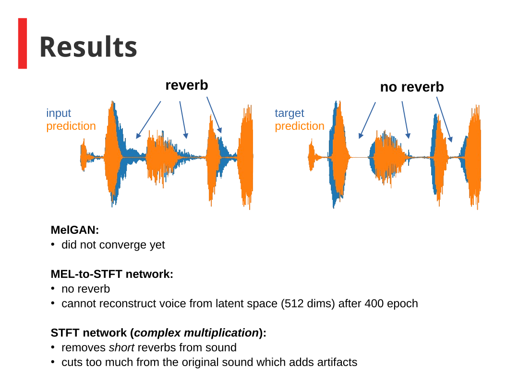

# Dereverberation-benchmark
Dreverberation/Deconvolution of audio

Usefull scripts and notebooks for testing of NN autoencoder architectures for audio dereverberation.
This was a part of the graduation project at Data Science Retreat batch 29. Watch on YouTube:
https://www.youtube.com/watch?v=wlEuOmiRJp8&t=8055s

At this point only the prototyping notebook is added. Check later for scripts, architectures and results or alternatively watch a YouTube presentation. 

# Results 

We achieved best results with an architecture similar to that used for a separation of audio sources (e.g. voice, guitar, bass, drums) from songs:
https://arxiv.org/pdf/1903.01415.pdf

